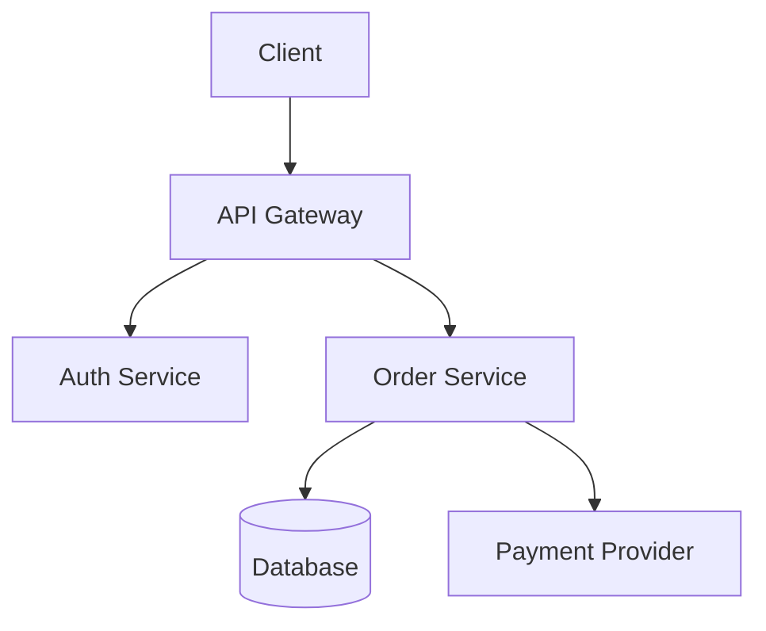

# Architecture Overview Patterns

Patterns for creating clear architecture documentation.

## Document Structure

### 1. Executive Summary

```markdown
# [System Name] Architecture

## Overview
[System Name] is a [type of system] that [primary purpose].
It handles [scale metrics] and serves [user types].

**Key Characteristics:**
- [Characteristic 1: e.g., "Event-driven architecture"]
- [Characteristic 2: e.g., "Microservices-based"]
- [Characteristic 3: e.g., "Multi-tenant SaaS"]
```

### 2. System Context Diagram

Show how the system fits in its environment:

```
┌─────────────────────────────────────────────────────────────┐
│                     External Systems                         │
├─────────────────────────────────────────────────────────────┤
│  ┌──────────┐  ┌──────────┐  ┌──────────┐  ┌──────────┐    │
│  │ Payment  │  │ Email    │  │ Analytics│  │ Identity │    │
│  │ Provider │  │ Service  │  │ Platform │  │ Provider │    │
│  └────┬─────┘  └────┬─────┘  └────┬─────┘  └────┬─────┘    │
└───────┼─────────────┼─────────────┼─────────────┼──────────┘
        │             │             │             │
        ▼             ▼             ▼             ▼
┌─────────────────────────────────────────────────────────────┐
│                      Our System                              │
│  ┌─────────────────────────────────────────────────────┐    │
│  │                    API Gateway                       │    │
│  └─────────────────────────────────────────────────────┘    │
│       │              │              │              │         │
│       ▼              ▼              ▼              ▼         │
│  ┌─────────┐   ┌─────────┐   ┌─────────┐   ┌─────────┐     │
│  │ Service │   │ Service │   │ Service │   │ Service │     │
│  │    A    │   │    B    │   │    C    │   │    D    │     │
│  └─────────┘   └─────────┘   └─────────┘   └─────────┘     │
└─────────────────────────────────────────────────────────────┘
        │             │             │             │
        ▼             ▼             ▼             ▼
┌─────────────────────────────────────────────────────────────┐
│                      Data Stores                             │
│  ┌──────────┐  ┌──────────┐  ┌──────────┐  ┌──────────┐    │
│  │PostgreSQL│  │  Redis   │  │   S3     │  │Elastics. │    │
│  └──────────┘  └──────────┘  └──────────┘  └──────────┘    │
└─────────────────────────────────────────────────────────────┘
```

### 3. Component Documentation

For each major component:

```markdown
## [Component Name]

### Purpose
[1-2 sentences describing what this component does]

### Responsibilities
- [Responsibility 1]
- [Responsibility 2]
- [Responsibility 3]

### Technology Stack
| Layer | Technology | Rationale |
|-------|------------|-----------|
| Runtime | Node.js 18 | Team expertise, async I/O |
| Framework | Express | Simple, well-known |
| Database | PostgreSQL | ACID compliance needed |

### Interfaces
**Exposes:**
- REST API on port 8080
- gRPC on port 9090
- Events to `orders.*` topic

**Consumes:**
- User Service API
- Payment Provider webhook
- `inventory.*` events

### Code Location
```
src/
├── services/
│   └── order-service/
│       ├── src/
│       ├── tests/
│       └── README.md
```

### Key Files
- `src/controllers/orders.ts` - API handlers
- `src/services/order-processor.ts` - Core logic
- `src/events/handlers.ts` - Event processing
```

## Data Flow Diagrams

### Sequence Diagram Pattern

```markdown
## Order Processing Flow

```
User          API Gateway    Order Service    Payment       Inventory
  │                │              │              │              │
  │  POST /orders  │              │              │              │
  │───────────────>│              │              │              │
  │                │ create_order │              │              │
  │                │─────────────>│              │              │
  │                │              │ reserve_items│              │
  │                │              │─────────────────────────────>│
  │                │              │              │   reserved   │
  │                │              │<─────────────────────────────│
  │                │              │ charge       │              │
  │                │              │─────────────>│              │
  │                │              │   success    │              │
  │                │              │<─────────────│              │
  │                │    201       │              │              │
  │                │<─────────────│              │              │
  │     201        │              │              │              │
  │<───────────────│              │              │              │
```
```

### State Machine Pattern

```markdown
## Order States

```
     ┌─────────┐
     │ CREATED │
     └────┬────┘
          │ payment_initiated
          ▼
     ┌─────────┐
     │ PENDING │──────────────────┐
     └────┬────┘                  │
          │ payment_success       │ payment_failed
          ▼                       ▼
     ┌─────────┐            ┌─────────┐
     │CONFIRMED│            │ FAILED  │
     └────┬────┘            └─────────┘
          │ shipped
          ▼
     ┌─────────┐
     │ SHIPPED │
     └────┬────┘
          │ delivered
          ▼
     ┌─────────┐
     │DELIVERED│
     └─────────┘
```
```

## Cross-Cutting Concerns

Document how these are handled across components:

```markdown
## Cross-Cutting Concerns

### Authentication & Authorization
- **Method:** JWT tokens via Auth0
- **Flow:** See [Auth Flow Diagram](./auth-flow.md)
- **Code:** `src/middleware/auth.ts`

### Logging
- **Format:** JSON structured logs
- **Levels:** ERROR, WARN, INFO, DEBUG
- **Correlation:** Request ID in all logs
- **Code:** `src/lib/logger.ts`

### Error Handling
- **Strategy:** Fail fast, circuit breakers
- **Format:** RFC 7807 Problem Details
- **Code:** `src/middleware/error-handler.ts`

### Configuration
- **Method:** Environment variables
- **Secrets:** AWS Secrets Manager
- **Code:** `src/config/index.ts`
```

## Diagram Tools

Recommended tools for architecture diagrams:

| Tool | Best For | Format |
|------|----------|--------|
| Mermaid | Embedded in markdown | Text-based |
| PlantUML | Complex diagrams | Text-based |
| Draw.io | Visual editing | XML/PNG |
| Excalidraw | Sketchy diagrams | JSON |
| ASCII | README compatibility | Plain text |

### Mermaid Example

```markdown

```
